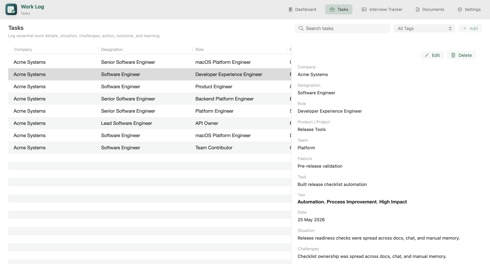

# Work Log

Native macOS app for structured career tracking.

## V1 Scope

- Tasks: table-first work log with company, designation, role, project/product, team, feature, task, lightweight planner subtasks, searchable multiselect tags, date range, situation, challenges, skills used, action, outcome, and learning.
- Interview Tracker: minimal company-role tracker with status, next action, due date, cooldown period input, calculated stage/last activity/eligible-again date/result/referral summary, optional referral details, interview rounds, and notes.
- Documents: standalone document vault for resumes, offer letters, relieving letters, certificates, salary files, and other career documents. Documents are not linked to interview opportunities.
- Settings: backup status, manual backup, restore latest backup, export JSON, and data folder shortcuts.
- Top navigation: no sidebar; the app icon and title stay visible at the top.
- Appearance: light, dark, and system theme modes.
- Demo data: disabled by default for production-style builds. You can still opt in for local testing.

## Build

Use the project script to compile and launch the app:

```bash
./script/build_and_run.sh
```

To verify the build without keeping the app in the foreground:

```bash
./script/build_and_run.sh --verify
```

The script directly compiles the SwiftUI sources with `swiftc`, stages `dist/Work Log.app`, and launches it as a real macOS app bundle. It avoids `swift build` because the active Command Line Tools install has a SwiftPM `PackageDescription` manifest-link mismatch on this machine.

To build without launching:

```bash
./script/build_and_run.sh build
```

To enable sample/demo data for local testing:

```bash
WORKLOG_ENABLE_DEMO_DATA=1 ./script/build_and_run.sh
```

## Production Packaging

The app bundle now carries release metadata through Info.plist keys:

- `CFBundleIdentifier`
- `CFBundleShortVersionString`
- `CFBundleVersion`
- `LSApplicationCategoryType`
- `WorkLogReleaseChannel`
- `WorkLogEnableDemoData`

Default build values can be overridden with environment variables:

```bash
WORKLOG_BUNDLE_ID=com.example.WorkLog
WORKLOG_VERSION=1.0.0
WORKLOG_BUILD=100
WORKLOG_RELEASE_CHANNEL=release
```

To create a signed release bundle and zip archive:

```bash
WORKLOG_SIGNING_IDENTITY="Developer ID Application: Your Name (TEAMID)" \
WORKLOG_VERSION=1.0.0 \
WORKLOG_BUILD=100 \
./script/package_release.sh
```

To include notarization and stapling in the same flow:

```bash
WORKLOG_SIGNING_IDENTITY="Developer ID Application: Your Name (TEAMID)" \
WORKLOG_NOTARY_PROFILE="your-notarytool-profile" \
WORKLOG_VERSION=1.0.0 \
WORKLOG_BUILD=100 \
./script/package_release.sh
```

Release packaging always forces `WORKLOG_ENABLE_DEMO_DATA=0`.

## Screenshot



The screenshot shows the tasks view of the app on macOS.
The data is dummy data in the screenshot.

## App Icon

The top bar and runtime Dock icon use a simple SwiftUI vector mark. The vector source file is:

```text
Sources/WorkLog/Support/AppIconArtwork.swift
```

Generated bundle resources are stored at:

```text
Resources/Images/work-log-icon.pdf
Resources/Images/work-log-icon.png
Resources/WorkLogIcon.icns
```

## Data

Primary app data:

```text
~/Library/Mobile Documents/com~apple~CloudDocs/Work Log/work-log-data.json
```

Imported documents:

```text
~/Library/Mobile Documents/com~apple~CloudDocs/Work Log/Documents/
```

Daily iCloud Drive backups:

```text
~/Library/Mobile Documents/com~apple~CloudDocs/Vault/Backups/Work Log/
```

If iCloud Drive is unavailable, the app falls back to:

```text
~/Library/Application Support/Work Log/Backups/
```

**This project is built using Codex by ChatGPT, OpenAI.**